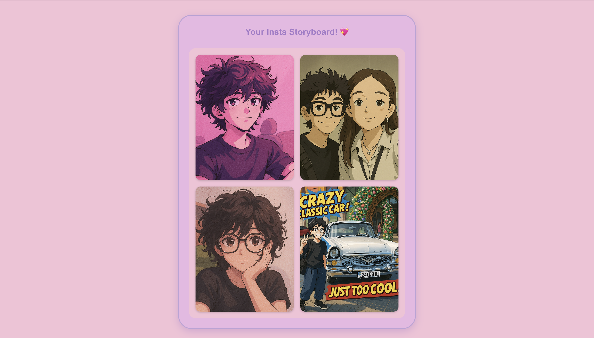
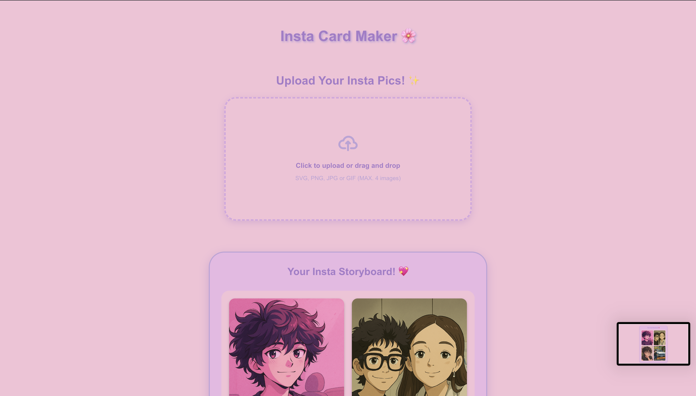

# fInsta

i just made my first app in firebase studio using idx. how it works? pretty simple; upload up to 4 images, get story cards. ahah! that's it. fInsta!

yoo, put a star!

by [yaps.gg](https://yaps.gg)